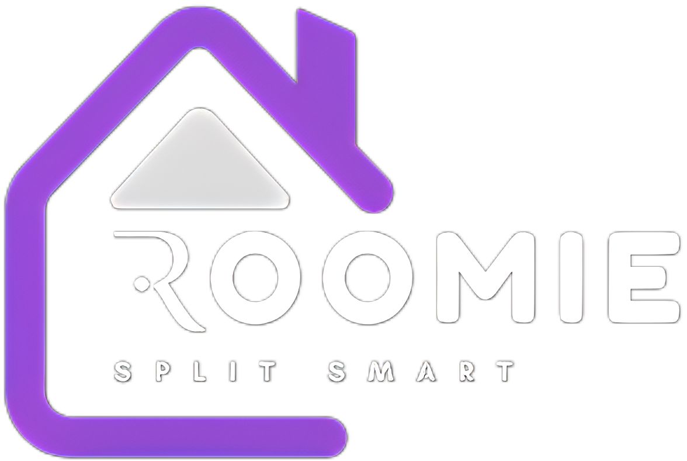

<div align="center">

# Roomie 

### Roommate Expense Management Application

[](https://www.typescriptlang.org/)
[](https://reactjs.org/)
[](https://nodejs.org/)
[](https://www.mongodb.com/)
[](https://tailwindcss.com/)

</div>

---

## 📑 Table of Contents

- [📋 Overview](#-overview)
- [🎯 Purpose](#-purpose)
- [🚀 Use Cases](#-use-cases)
- [✨ Features](#-features)
- [📖 How to Use](#-how-to-use)
- [🛠️ Technical Details](#️-technical-details)
- [🔒 Security Features](#-security-features)
- [🤝 Contribution Guidelines](#-contribution-guidelines)
- [📄 License](#-license)

---

## 📋 Overview

Roomie is a comprehensive web application designed to simplify the management of shared living expenses among roommates. It provides a centralized platform for tracking expenses, managing bills, handling payments, and enforcing contribution rules through a penalty system.

---

## 🎯 Purpose

Managing finances in a shared living situation can be challenging and often leads to conflicts. Roomie aims to solve this problem by providing:


| Feature | Description |
|---------|-------------|
| 📊 | Transparent expense tracking |
| 💸 | Automated bill splitting |
| 📈 | Payment status monitoring |
| ⚖️ | Fair penalty system for rule violations |
| 👥 | User management with different permission levels |


---

## 🚀 Use Cases

- **Expense Tracking**: Roommates can log their expenses and contributions to the household
- **Bill Management**: Create and split bills among roommates automatically
- **Payment Tracking**: Monitor who has paid their share and who still owes money
- **Penalty System**: Enforce house rules through financial penalties for violations
- **User Management**: Admins can invite new roommates and manage user roles

---

## ✨ Features

<details>
<summary><b>🔐 Authentication System</b></summary>
<br>

- User registration and login
- Password reset functionality
- Role-based access control (Admin, Co-Admin, User)
- Invitation system for new roommates
</details>

<details>
<summary><b>📊 Dashboard</b></summary>
<br>

The dashboard provides quick access to all main features:

- Entries management
- Payments tracking
- Penalties overview
- User management (for admins)
</details>

<details>
<summary><b>📝 Entries Management</b></summary>
<br>

Entries represent individual expenses or contributions:

- Add new entries with name, amount, and date
- View all entries in a sortable and filterable list
- Approve or reject entries (based on permissions)
- Delete or restore entries
</details>

<details>
<summary><b>💰 Payments System</b></summary>
<br>

The payments system helps manage bills and track payments:

- Create bills with multiple items
- Automatically split bills among roommates
- Track payment status (Paid/Pending)
- Send payment reminders
- View payment statistics (total received, total pending)
</details>

<details>
<summary><b>⚖️ Penalty System</b></summary>
<br>

The penalty system helps enforce house rules:

- Apply penalties for late payments, damages, rule violations, or minimum entry requirements
- Automatic penalty application based on configurable settings
- Penalty settings include contribution percentage and warning period
- View and manage all penalties
</details>

<details>
<summary><b>👥 User Management</b></summary>
<br>

Admins can manage users in the flat:

- Invite new users via email
- Assign roles (Admin, Co-Admin, User)
- View user activities
- Manage user profiles
</details>

<details>
<summary><b>🔔 Push Notifications</b></summary>
<br>

Stay informed about important activities in your flat:

- Real-time notifications when flatmates add new entries
- Notifications when your entries are approved or rejected
- Easy permission management through the dashboard
- Test notifications to ensure everything works
- Works on both desktop and mobile devices
</details>

---

## 📖 How to Use

### Getting Started

1. **Registration**: Create an account as an Admin with your flat name
2. **Login**: Access your dashboard using your credentials
3. **Invite Roommates**: Use the User Management section to invite your roommates

<details>
<summary><b>Managing Entries</b></summary>
<br>

1. Navigate to the Entries section from the dashboard
2. Click "Add Entry" to record a new expense
3. Fill in the required details (name, amount, date)
4. Submit the entry for approval
5. Admins can approve or reject entries as needed
</details>

<details>
<summary><b>Managing Bills and Payments</b></summary>
<br>

1. Navigate to the Payments section from the dashboard
2. Admins can click "Create Bill" to add a new bill
3. Add bill items with names and amounts
4. The system will automatically calculate the split amount per user
5. Users can mark their payments as "Paid"
6. Admins can send reminders for pending payments
</details>

<details>
<summary><b>Managing Penalties</b></summary>
<br>

1. Navigate to the Penalties section from the dashboard
2. Admins can add penalties for specific users
3. Select the penalty type, amount, and add a description
4. Configure penalty settings including contribution percentage and warning period
5. The system can automatically apply penalties based on the settings
</details>

<details>
<summary><b>User Profile Management</b></summary>
<br>

1. Click on your profile name in the header
2. Update your profile information
3. Change your password if needed
4. View your activity history
</details>

---

## 🛠️ Technical Details

### Technology Stack


| Category | Technologies |
|----------|-------------|
| **Frontend** | React, TypeScript, Tailwind CSS, Shadcn UI components |
| **Backend** | Node.js, Express |
| **Database** | MongoDB with Mongoose |
| **Authentication** | Custom JWT-based authentication |
| **State Management** | React Query |
| **Form Handling** | React Hook Form with Zod validation |
| **Email Service** | SendGrid |


### Project Structure

```
├── /client                 # Frontend React application
│   ├── /src/components     # Reusable UI components
│   ├── /src/pages          # Application pages
│   ├── /src/hooks          # Custom React hooks
│   └── /src/lib            # Utility functions
│
├── /server                 # Backend Express application
│   ├── routes.ts           # API endpoints
│   ├── auth.ts             # Authentication logic
│   ├── storage.ts          # Database operations
│   ├── email.ts            # Email sending functionality
│   └── penalty-checker.ts  # Automated penalty system
│
└── /shared                 # Shared code between frontend and backend
    └── schema.ts           # Data models and validation schemas
```

### Installation and Setup

<div align="center">

```bash
# Clone the repository
git clone https://github.com/yourusername/roomie.git
cd roomie

# Install dependencies
npm install

# Set up environment variables in .env file

# Start the development server
npm run dev
```

</div>

### Production Deployment

<div align="center">

```bash
# Build the application
npm run build

# Start the production server
npm start
```

</div>

---

## 🔒 Security Features


| Feature | Description |
|---------|-------------|
| 🔑 | JWT-based authentication |
| 🔐 | Password hashing |
| 👮 | Role-based access control |
| 🔄 | Secure password reset mechanism |
| ✅ | Input validation using Zod |
| 🛡️ | Protection against common web vulnerabilities |


---

## 🤝 Contribution Guidelines

1. Fork the repository
2. Create a feature branch (`git checkout -b feature/amazing-feature`)
3. Make your changes
4. Commit your changes (`git commit -m 'Add some amazing feature'`)
5. Push to the branch (`git push origin feature/amazing-feature`)
6. Submit a pull request

---

## 📄 License

<div align="center">

MIT

<p align="center">Made with ❤️ by the Roomie Team</p>

</div>